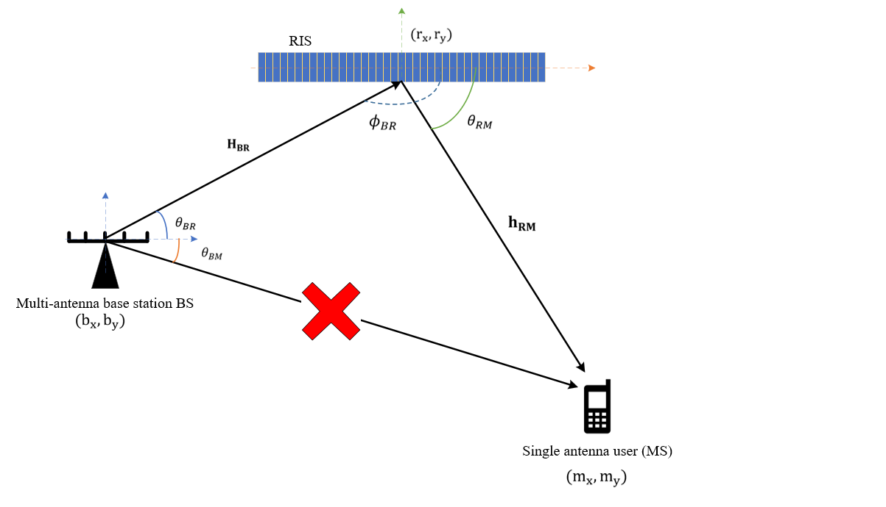

# RIS-Aided Integrated Sensing and Communication System

This project analyzes and optimizes a **Reconfigurable Intelligent Surface (RIS)-assisted Integrated Sensing and Communication (ISAC)** system for future 6G wireless networks. The system aims to jointly improve **data transmission** and **user localization** through intelligent control of RIS phase shifts.

---

## Overview

The project focuses on a **single-user mm-Wave ISAC system**, where the only available communication path is via a passive RIS. The system’s performance is evaluated in terms of:

- **Effective Achievable Data Rate (EADR)**: Communication performance metric  
- **Cramér-Rao Lower Bound (CRLB)**: Localization accuracy metric

Optimization is performed using **Particle Swarm Optimization (PSO)** with two different problem formulations:

- **Weighted-sum multi-objective optimization**  
- **Penalty-based constrained optimization**

---

## System Model

The system consists of:

- A **Base Station (BS)** equipped with a Uniform Linear Array (ULA) of $N_B$ antennas  
- A **Reconfigurable Intelligent Surface (RIS)** with $N_R$ passive reflecting elements  
- A **User Equipment (UE)** with a single antenna

### Key Assumptions

- The **direct BS-to-UE link is blocked**, so all communication occurs via the RIS.
- The system uses **MISO-OFDM** architecture with $N$ subcarriers.
- The RIS elements apply **controllable phase shifts** to the incoming signals.

### End-to-End Channel Model

The effective channel from BS to UE through the RIS is modeled as:

$$
\mathbf{h}[n] = \mathbf{h}_{\text{RM}}[n] \cdot \mathbf{\Phi} \cdot \mathbf{H}_{\text{BR}}[n]
$$

Where:
- $\mathbf{H}_{\text{BR}}[n]$: Channel from BS to RIS  
- $\mathbf{h}_{\text{RM}}[n]$: Channel from RIS to UE  
- $\mathbf{\Phi}$: Diagonal matrix representing RIS phase shifts

The received signal on subcarrier $n$ is:

$$
y[n] = \sqrt{P} \cdot \mathbf{h}[n]\mathbf{f} \cdot x[n] + w[n]
$$

Performance metrics include:
- **EADR**:

$$
R = \sum_n \log_2\left(1 + \frac{P}{\sigma^2} \left| \mathbf{h}[n] \mathbf{f} \right|^2 \right)
$$

- **CRLB** for localization accuracy, computed from the Fisher Information Matrix (FIM)

---

## Optimization Formulations

The RIS phase shift optimization is conducted using **Particle Swarm Optimization (PSO)**. Two problem formulation strategies are explored:

### 1. Weighted-Sum Multi-Objective Optimization

A linear combination of EADR and CRLB:

$$
\phi^* = \arg\max_{\phi} \ \alpha \cdot R - \beta \cdot \text{CRLB}
$$

- $\alpha, \beta > 0$: weights for communication and localization performance  
- **Drawback:** Sensitive to the scale of $R$ and CRLB, causing one metric to dominate. At high SNR, $R$ tends to overpower CRLB.

---

### 2. Penalty-Based Constrained Optimization

Instead of combining $R$ and CRLB directly, **one metric is optimized while treating the other as a constraint**:

#### Maximize Communication with Localization Constraint:
$$
\begin{aligned}
\phi^* &= \arg\max_{\phi} \ R \\
\text{s.t.} &\quad \text{CRLB} \leq \epsilon
\end{aligned}
$$

#### Maximize Localization with Communication Constraint:
$$
\begin{aligned}
\phi^* &= \arg\min_{\phi} \ \text{CRLB} \\
\text{s.t.} &\quad R \geq \epsilon
\end{aligned}
$$

---

### Penalty Function Design

To handle constraints using PSO, the constrained problem is transformed into an unconstrained one using a **penalty function**:

$$
F(\phi) = f(\phi) + H(\phi)
$$

Where:
- $f(\phi)$ is the primary objective (e.g., $-R$ for maximization or CRLB minimization)
- $H(\phi)$ is the penalty term that penalizes constraint violations:
  
$$
H(\phi) = \sum_i \theta(q_i(\phi)) \, q_i(\phi)^{\gamma}
$$

Here:
- $q_i(\phi) = \max\{0, g_i(\phi)\}$ is the violation magnitude of the $i$-th constraint
- $\theta(\cdot)$ is a scaling coefficient, and $\gamma$ controls penalty severity.

**Example:**
- If $R < \epsilon_R$, we add a large penalty proportional to $(\epsilon_R - R)^2$.
- If CRLB exceeds $\epsilon_C$, we penalize $(\text{CRLB} - \epsilon_C)^2$.

This forces the PSO particles to search within feasible regions that meet the required trade-off between $R$ and CRLB.

---

### Why Penalty-Based Optimization?

- **No scale mismatch:** Unlike the weighted-sum method, penalties only activate when constraints are violated.
- **Better convergence:** The optimizer focuses on improving the primary objective without being dominated by one metric.
- **Near-optimal solutions:** The penalty-based PSO achieved performance close to the theoretical bound in experiments.

---

## Main Contributions

- Developed a **single-user ISAC system model** for RIS-aided mm-Wave communication and localization  
- Designed and implemented **PSO-based optimization with penalty functions**
- Demonstrated that penalty-based formulation **outperforms weighted-sum approaches**  
- Benchmarked performance against **theoretical optimal RIS configurations**

---

## Results Summary

- PSO with penalty-based constrained optimization achieves **near-optimal performance**  
- Weighted-sum methods are prone to **imbalanced trade-offs**, especially at high SNRs  
- Optimized RIS phases significantly outperform random and constant phase configurations

